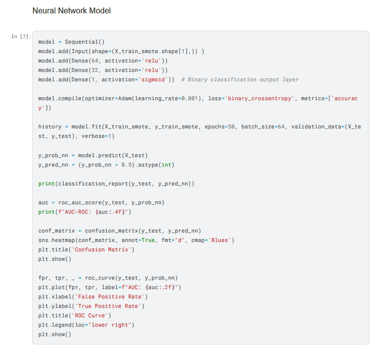

### Who I am
##### I graduated from Aberystwyth University in 2021 with a degree in Mathematics, kick starting my professional career in a banking graduate scheme before pursuing a career in data science and landing my first internship at a local agricultural business as a business analyst, learning key business principles while working directly with the company director, applying and developing my analytical skills.
##### I'm a life long student of Mathematics with keen interests in data driven solutions and scientific problem solving.
##### The Tech industry is always evolving and I love being able to grow with it. I always embrace the opportunity to learn new things and develop ideas into practical solutions.

### My Projects
[Machine Learning Models for Detecting Credit Card Fraud](https://www.kaggle.com/code/tom1123/machine-learning-models-to-detect-fraud)

##### The aim of this project was to develop reliable machine learning models to detect fraud, while optimising each model to achieve strong precision and ROC scores to effectively identify fraudulent transactions while minimising false positives and errors. I preprocessed the data, chose each supervised model, and evaluated each one to optimise predictive performance. 

[Retail Trends and KPIs PowerBI Dashboard](https://github.com/GHtjm/Retail-Sales-PowerBI)
##### I created PowerBI dashboards, making use of DAX queries to identify key performance indicators for the retail sales dataset which I selected, picking out and visualising KPIs that were calculatable from the dataset used. As well as templating the dashboard    to allow for easy replication for new data, with a variety of different templates and DAX queries for different KPI selections.

[Optimising Business Data with SQL Database Manipulation](https://github.com/GHtjm/Optimising-Business-Data-with-SQL-Database-Manipulation)
##### I utilised SQL queries to transform large datasets, subsequently improving the speed of querying data using a large business based dataset by (Node processing time ranging from (114ms - 380 ms with 225 ms average processing time to 57ms - 211 ms at 114ms average processing time, as the results show). Demonstrating a keen understanding of SQL querying and optimisation.

### Education
##### BSc Mathematics 2:1,  Aberystwyth University
#### Relevant modules studied:
- ##### [Applied Statistics](https://www.aber.ac.uk/en/modules/deptcurrent/MA26600/AB1/)
- ##### [Distributions and Estimation](https://www.aber.ac.uk/en/modules/deptcurrent/MA26010/AB1/)
- ##### [Graphs and Networks](https://www.aber.ac.uk/en/modules/deptcurrent/MA32410/AB2/)
- ##### [Linear Algebra](https://www.aber.ac.uk/en/modules/deptfuture/MA21410/AB2/)
- ##### [Numerical Analysis](https://www.aber.ac.uk/en/modules/deptcurrent/MA25220/)
- ##### [Numerical Solutions of Partial Differential Equations](https://www.aber.ac.uk/en/modules/2021/MA34710/)
- ##### [Probability](https://www.aber.ac.uk/en/modules/deptcurrent/MA10310/AB1/)
- ##### [Statistics](https://www.aber.ac.uk/en/modules/deptcurrent/MA11310/AB2/)

#### Certifications:
- ##### Analyzing and Visualizing Data with Excel - Microsoft
- ##### achine learning and AI with Python, HarvardX
- ##### The Data Science Method - IBM

### Technical Skills

#### Programming: 
- ##### Python, R, SQL 

#### Libraries: 
- ##### NumPy, Pandas, seaborn, Matplotlib, Keras, PySpark, TensorFlow SciKit, SciPy, randomForest, AdaBoost, CatBoost, XGBoost, LightGBM

#### Tools: 
- ##### Power BI, Tableau, Excel, Access, Azure, SQL Server

