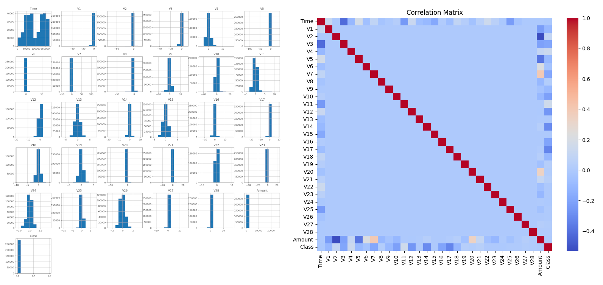
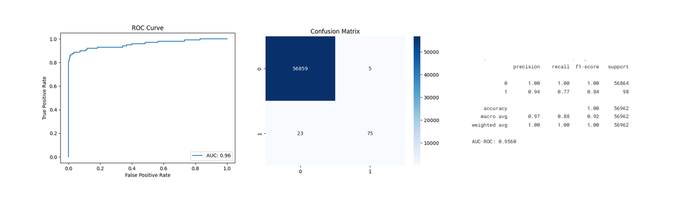
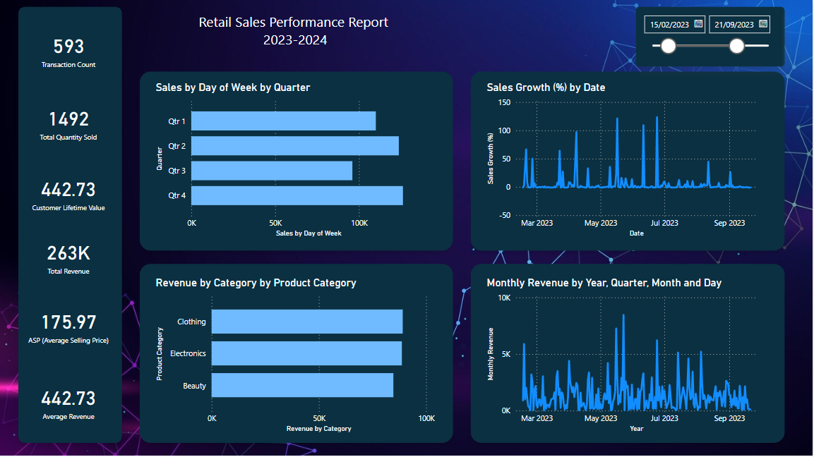
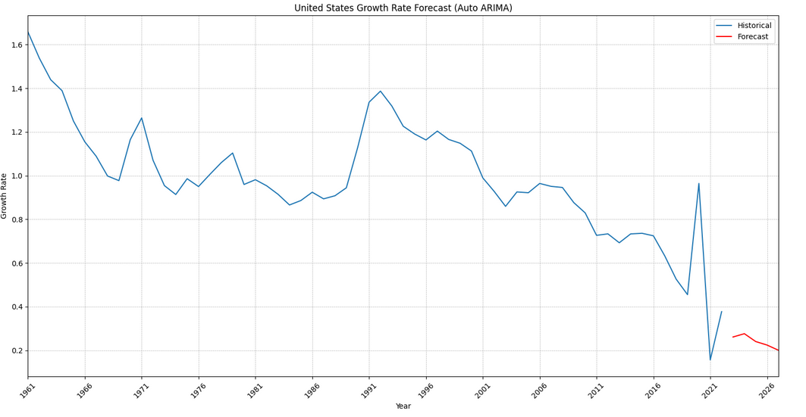

## Selected Projects in Data science, Machine Learning, and Data Visualisation
---
### Machine Learning Models for Detecting Credit Card Fraud
Credit Card Fraud is more prevalent in today's society than at any point in our digital history where over £551 million pounds was lost to credit, debit and payment card fraud in the UK last year alone. I built a Random Forest model, an XGBoost model, a Logistic Regression model, and developed a Multilayer Perceptron Neural Network model using Python to explore and detect fraud.
#### Dataset EDA

#### Neural Network Performance Metrics

[View on Kaggle](https://www.kaggle.com/code/tom1123/machine-learning-models-to-detect-fraud)

---
### Retail Trends and KPIs PowerBI Dashboard

I created PowerBI dashboards, making use of DAX queries to identify key performance indicators for the retail sales dataset which I selected, picking out and visualising KPIs that were calculatable from the dataset used. As well as templating the dashboard to allow for easy replication for new data, with a variety of different templates and DAX queries for different KPI selections.

[View on GitHub](https://github.com/GHtjm/Retail-Sales-PowerBI)

---
### Optimising Business Data with SQL Database Manipulation
I utilised SQL queries to transform large datasets, subsequently improving the speed of querying data using a large business based dataset by (Node processing time ranging from (114ms - 380 ms with 225 ms average processing time to 57ms - 211 ms at 114ms average processing time, as the results show). Demonstrating a keen understanding of SQL querying and optimisation.

[View on GitHub](https://github.com/GHtjm/Optimising-Business-Data-with-SQL-Database-Manipulation)

---
### Fantasy Premier League Power BI Dashboard

I created an FPL dashboard using PowerBI, Using DAX queries to create KPIs for a strong FPL selection. I used PowerShell to connect to the FPL API, ran and cleaned the data through Excel before inputting it into Power BI and making clean interactive visualisations.

[View on GitHub](https://github.com/GHtjm/FPL-Dashboard)

---
## Older Projects
### Machine learning models with R

[View on GitHub](https://htmlpreview.github.io/?https://github.com/GHtjm/GHtjm.github.io/blob/main/assets/docs/creditcardfraudknit.html)

---
### Python World Population Growth EDA

[View on Kaggle](https://www.kaggle.com/code/tom1123/world-population-growth-eda?scriptVersionId=206181771)

---
### Useful Functions and equations for Data Science
[View on GitHub](https://github.com/GHtjm/Resources)

---
## University projects

---
### A statistical analysis of car manufacturers and their environmental impact

[View on GitHub](https://github.com/GHtjm/University-Projects)

---
### Numerical solutions to Partial Differential Equations

[View on GitHub](https://github.com/GHtjm/University-Projects)

